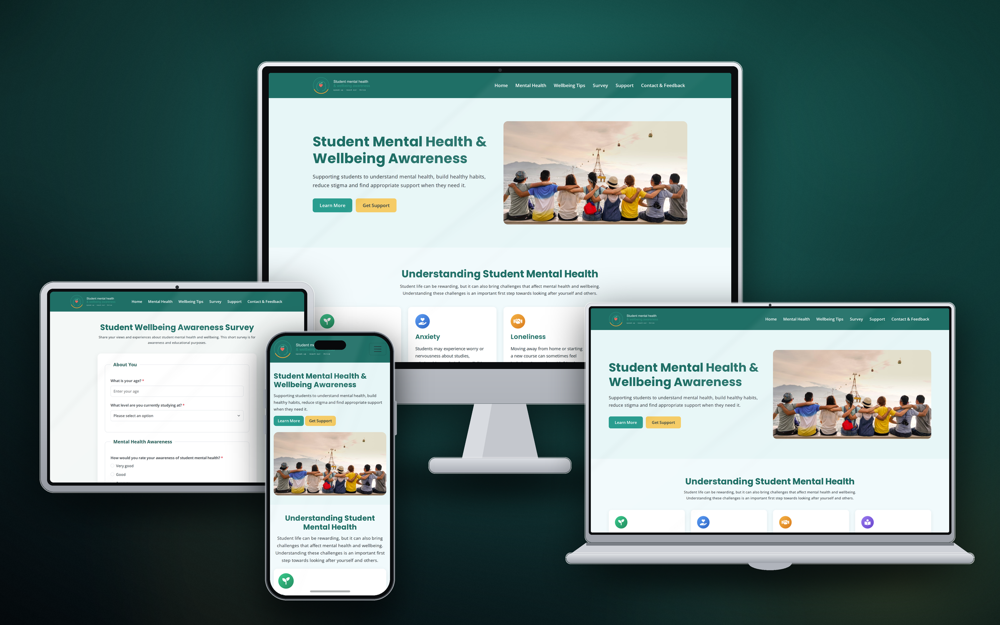
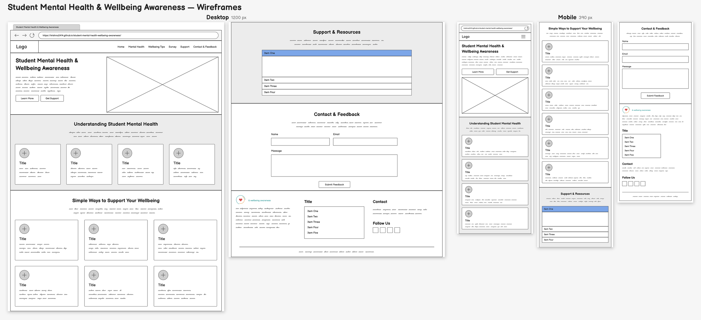
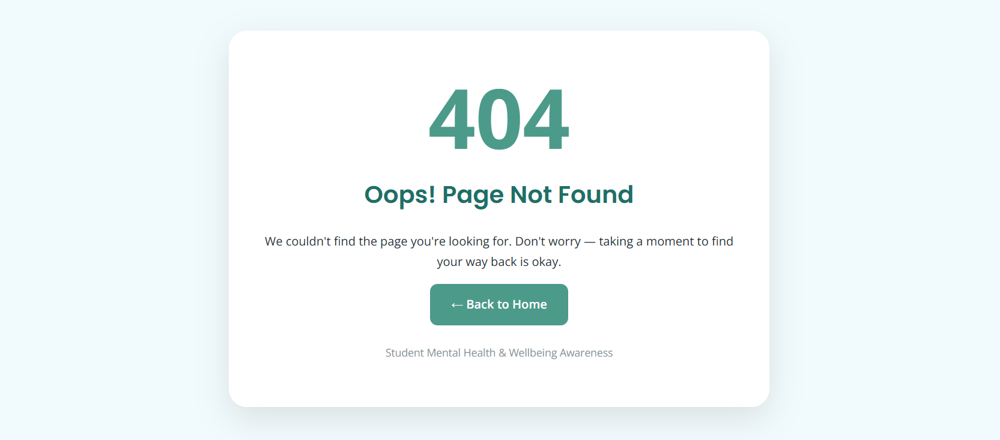
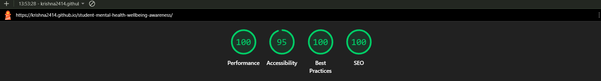
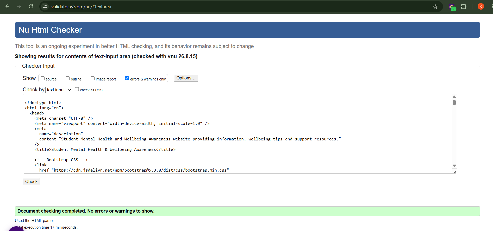
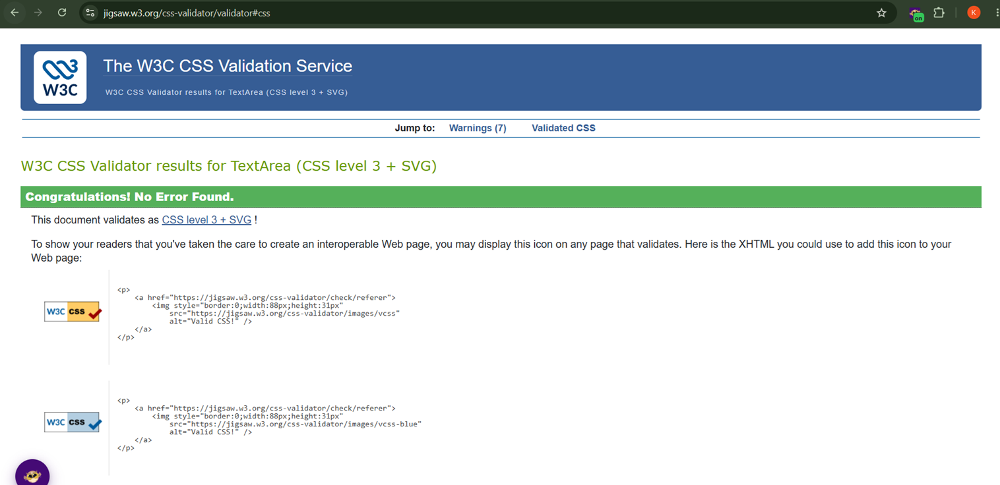

# Student Mental Health & Wellbeing Awareness

A responsive and accessible educational website designed to raise awareness of student mental health and wellbeing. The website provides information about common challenges students may experience, practical wellbeing advice, and links to relevant support services.

The live website can be found [here](https://krishna2414.github.io/student-mental-health-wellbeing-awareness/).

---

# Project Overview

The aim of this project is to create an informative, welcoming and accessible website that raises awareness of student mental health and wellbeing.

Students can experience a range of pressures, including academic workload, examinations, financial concerns, relationships, changes in routine and uncertainty about the future. The website provides accessible information intended to help students better understand these challenges and identify appropriate sources of support.

The project focuses on:

- Raising awareness of student mental health and wellbeing.
- Providing clear and easy-to-understand information.
- Encouraging students to recognise when they may need additional support.
- Providing practical wellbeing advice.
- Making reputable support resources easy to find.
- Creating a responsive experience across desktop, tablet and mobile devices.
- Using clear navigation and accessible content.
- Providing a welcoming and non-judgemental user experience.

The website is an educational awareness project and does not provide medical diagnosis or professional mental health treatment.

---

# UX / Design

## Project Goals

The main goals of the website are to:

- Help students learn more about mental health and wellbeing.
- Explain common challenges experienced by students.
- Provide practical suggestions for maintaining wellbeing.
- Encourage students to seek appropriate support when needed.
- Make external support resources easy to access.
- Create a welcoming and non-judgemental environment.
- Ensure important information can be found quickly.
- Provide a consistent experience across different screen sizes.
- Make the website accessible and straightforward to navigate.

## User Stories

### As a student, I want to:

- Understand more about mental health and wellbeing.
- Learn about common challenges experienced by students.
- Find practical tips for looking after my wellbeing.
- Navigate easily between different sections.
- Find information about where I can get help.
- Access the website comfortably on a mobile phone, tablet or desktop.
- Use a website that feels welcoming, clear and non-judgemental.

### As a visitor, I want to:

- Understand the purpose of the website immediately.
- Find relevant information without unnecessary navigation.
- Access external support resources easily.
- Feel confident that information is presented clearly and responsibly.
- Use the website without needing specialist knowledge.

---

## Design

The website uses a clean and simple layout to make potentially sensitive information approachable and easy to read.

The design focuses on:

- Clear headings and sections.
- Short paragraphs and accessible language.
- Consistent spacing.
- Clear calls to action.
- Easy-to-identify navigation.
- Responsive layouts.
- Accessible links and buttons.
- A calm and welcoming visual presentation.
- Logical grouping of related information.

The one-page structure allows users to access the main information without navigating through multiple levels of pages.

---

## Wireframes

Wireframes were used during the planning stage to consider the structure and placement of key content before development.

The planned structure included:

- Header and navigation.
- Hero/introduction section.
- Mental health information.
- Wellbeing advice.
- Support and resources.
- Contact/feedback functionality.
- Footer.

### Wireframe Evidence

Balsamiq – Wireframes were created using balsamiq from https://balsamiq.com/wireframes/desktop/#

- **Desktop Wireframe:** [View Desktop Wireframe Design](assets/images/wireframe-desktop.png)

- **Mobile Wireframe:** [View Mobile Wireframe Design](assets/images/wireframe-mobile.png)

---

## Typography

- **Poppins** — used for headings and section titles.
- **Open Sans** — used for body text and general content.

Open Sans was selected because it provides:

- Good readability.
- Clear distinction between headings and body text.
- A clean and approachable appearance.
- Good readability across different screen sizes.
- A suitable style for an educational and wellbeing-focused website.

---

## Colour Scheme

The colour palette was selected to create a calm, approachable and accessible visual experience.

The design aims to provide sufficient contrast between text and backgrounds while avoiding an overly clinical appearance.

A consistent colour scheme is used throughout the website for:

- Navigation.
- Headings.
- Buttons.
- Links.
- Content sections.
- Footer elements.

The colour choices were also reviewed as part of accessibility testing.

---

# Features

## Navigation

The website includes a clear navigation menu that allows users to move between the main sections.

The navigation is designed to:

- Make important information easy to locate.
- Provide consistent navigation.
- Work across desktop, tablet and mobile devices.
- Allow users to return to the home section.
- Reduce unnecessary navigation.
- Provide a mobile-friendly collapsed menu.

The navigation links were manually tested to confirm that they direct users to the intended sections.

---

## Home Page

The home page introduces the purpose of the website and provides users with an overview of the information available.

The page includes:

- A welcoming hero section.
- An introduction to student mental health and wellbeing.
- Information about the purpose of the project.
- Clear calls to action.
- Links to relevant sections of the website.

The home page is designed to help visitors understand the purpose of the website immediately.

---

## Mental Health & Wellbeing

The website provides accessible information about mental health and wellbeing topics relevant to students.

Topics include areas such as:

- Stress.
- Anxiety.
- Loneliness.
- Academic Pressure.
- Recognising when additional support may be needed.

Content is organised into clear sections so users can find information relevant to them without having to read large amounts of text at once.

---

## Support & Resources

A dedicated support section provides information about where students can find further help.

Resources include reputable organisations and services such as:

- Talk to Someone.
- NHS Mental Health Information.
- Counselling & Wellbeing Services.
- Online Resources.
- Other reputable wellbeing resources.

External resources are clearly identified and linked so users can access additional information when required.

---

## Contact & Feedback

The website includes a contact/feedback area allowing visitors to interact with the project.

The form and associated controls were manually tested to check:

- Labels and input fields.
- Button functionality.
- Usability.
- Layout on smaller screens.
- Visual consistency.

## Wellbeing Survey

The website includes a dedicated Wellbeing Survey page, accessible from the main navigation and footer.

The survey allows users to provide information about their wellbeing through a series of structured questions. The page was designed to be clear, accessible and straightforward to complete.

**Survey Features**

The survey includes:

- Clearly labelled form fields.
- <fieldset> elements used to group related questions.
- <legend> elements to provide meaningful descriptions for each group of questions.
- Required fields where appropriate.
- Minimum and maximum validation constraints.
- Appropriate input types for different questions.
- Clear instructions to help users complete the survey.
- Responsive form layout for desktop, tablet and mobile devices.
- Custom JavaScript to provide interactive functionality and validation.
- Clear feedback when user input does not meet the required criteria.
- Accessible labels and form controls.

---

## Footer

The footer provides useful information and links and is displayed consistently throughout the website.

It can include:

- Copyright information.
- Navigation links.
- External support resources.
- Social media links, where applicable.
- Contact information, where applicable.

---

# 404 page

A custom 404 page is included in the project and is displayed when a user navigates to a broken or missing page.

The page provides a clear message informing the user that the requested page could not be found and provides navigation back to the main website.

Users can return to the main website directly from the 404 page without needing to rely on the browser's back button.

---

# Technologies Used

The following technologies and tools were used to develop the project:

- **HTML5** – used to structure the website content.
- **CSS3** – used for styling, layout, colours and responsive design.
- **Bootstrap 5** – used for responsive layout and interface components.
- **JavaScript** – used for interactive functionality where required.
- **Google Fonts** – used to provide the Open Sans typeface.
- **Font Awesome** – used for icons.
- **Google Fonts** — Poppins and Open Sans for fonts.
- **Git** – used for version control.
- **GitHub** – used to store and manage the project repository.
- **GitHub Pages** – used to deploy the live website.
- **Visual Studio Code** – used as the development environment.

---

# Testing

Testing was carried out throughout development to ensure the website functions correctly and provides a positive user experience across different devices and browsers.

Testing included:

- HTML validation.
- CSS validation.
- Responsive testing.
- Browser compatibility testing.
- Navigation testing.
- Link testing.
- Accessibility checks.
- Manual user-story testing.
- Lighthouse testing.

---

## Google Lighthouse

Google Lighthouse was used to evaluate the website against:

- Performance.
- Accessibility.
- Best Practices.
- SEO.

The Lighthouse report was reviewed to identify potential improvements.

### Lighthouse Results

---

# Browser Compatibility

The website was tested in the following browsers:

| Browser         | Result |
| --------------- | ------ |
| Google Chrome   | Pass   |
| Microsoft Edge  | Pass   |
| Mozilla Firefox | Pass   |
| Safari          | Pass   |

The following areas were checked:

- Page layout.
- Navigation.
- Internal links.
- External links.
- Images.
- Buttons.
- Responsive behaviour.
- Text readability.
- General usability.

---

# Responsiveness

The website was tested across different viewport sizes to ensure that content remains accessible and usable.

Testing included:

- Desktop screens.
- Laptop screens.
- Tablets.
- Mobile phones.

Particular attention was given to:

- Navigation behaviour.
- Text size.
- Spacing.
- Image scaling.
- Content width.
- Buttons and links.
- Horizontal scrolling.
- Overall page layout.

The responsive layout uses Bootstrap and CSS to adapt content to different screen sizes.

# Code Validation

The HTML and CSS were checked using the appropriate W3C validation tools.

## HTML Validation

The HTML was checked for structural and syntax errors.

Any errors identified during development were investigated and corrected.

### HTML Validation Evidence

---

## CSS Validation

The CSS was checked using the W3C CSS Validator.

Any identified issues were reviewed and corrected where appropriate.

### CSS Validation Evidence

---

# Manual Testing

The main features and user stories were manually tested.

| User Story                                                   | Test                                                                                                                            | Result |
| ------------------------------------------------------------ | ------------------------------------------------------------------------------------------------------------------------------- | ------ |
| As a student, I want to learn about mental health.           | Navigate to the mental health information section and confirm that the content is displayed correctly.                          | Pass   |
| As a student, I want to find wellbeing advice.               | Navigate to the wellbeing section and confirm that the advice is accessible and readable.                                       | Pass   |
| As a student, I want to find support resources.              | Open the support section and test the external resource links.                                                                  | Pass   |
| As a student, I want to complete the wellbeing survey.       | Open the Survey page, complete the required fields and test valid and invalid inputs, including minimum and maximum validation. | Pass   |
| As a visitor, I want to navigate the website easily.         | Test navigation links and confirm that they direct users to the correct sections.                                               | Pass   |
| As a mobile user, I want the website to be easy to use.      | Test the website at mobile viewport sizes and check navigation, layout and content.                                             | Pass   |
| As a visitor, I want readable content.                       | Check text size, spacing, contrast and page layout.                                                                             | Pass   |
| As a visitor, I want interactive controls to work correctly. | Test buttons, navigation controls and expandable content.                                                                       | Pass   |
| As a visitor, I want external support links to work.         | Open support links and confirm that they direct to the intended resources.                                                      | Pass   |
| As a visitor, I want to use the survey on a mobile device.   | Test the survey at mobile, tablet and desktop viewport sizes and check the form layout, controls and readability.               | Pass   |

---

# Accessibility Testing

Accessibility was considered throughout development.

The following areas were checked:

- Semantic HTML.
- Alternative text for informative images.
- Heading structure.
- Link and button labels.
- Colour contrast.
- Readable typography.
- Responsive layout.
- Keyboard-accessible interactive elements.
- Mobile usability.

Where accessibility issues were identified during development, changes were made to improve the user experience.

---

# Bugs

Any bugs discovered during development were investigated and corrected where possible.

Issues checked during development included:

- Navigation links directing to the wrong section.
- Layout issues at smaller screen sizes.
- Incorrect spacing or alignment.
- Broken external links.
- Images not displaying correctly.
- Text becoming difficult to read on smaller screens.
- Interactive components not responding as expected.

No known major unresolved bugs remain at the time of deployment.

If future issues are identified, they can be documented here along with the steps taken to resolve them.

---

# Deployment

## Creating the Repository

The project repository was created using GitHub.

The process was:

1. Sign in to GitHub.
2. Create a new repository.
3. Give the repository an appropriate name.
4. Create the repository.
5. Clone the repository to the development environment.
6. Add the project files.
7. Commit changes regularly.
8. Push changes to GitHub.

Git was used throughout development to track changes and maintain the project history.

---

## Deploying to GitHub Pages

The website was deployed using GitHub Pages.

The deployment process was:

1. Open the project repository on GitHub.
2. Select **Settings**.
3. Select **Pages** from the sidebar.
4. Under **Build and deployment**, select the appropriate branch.
5. Select the main branch.
6. Select the /root folder.
7. Click **Save**.
8. GitHub Pages generates the deployed website.
9. Open the generated URL.
10. Test the deployed version to confirm that it matches the development version.
11. Check navigation, images, forms and external links on the deployed website.

## Live Website

https://krishna2414.github.io/student-mental-health-wellbeing-awareness/

## GitHub Repository

https://github.com/Krishna2414/student-mental-health-wellbeing-awareness

---

# AI Use and Reflection

AI tools were used as part of the development process to support coding, debugging, optimisation and problem solving.

The use of AI was focused on supporting the development process rather than replacing testing or decision-making. Generated suggestions were reviewed, adapted and tested before being incorporated into the project.

## AI-Assisted Code Creation

AI was used to assist with aspects of front-end development, including generating or suggesting HTML, CSS and JavaScript solutions where appropriate.

The main benefit was reducing development time and providing alternative approaches to implementing particular interface features.

Any generated code was reviewed and adapted to fit the structure, design and requirements of the project.

## AI-Assisted Debugging

AI was also used to help investigate coding issues during development.

It helped identify possible causes of problems such as:

- Layout issues.
- Responsive behaviour.
- HTML structure.
- CSS styling.
- Interactive component behaviour.

Suggested solutions were tested manually before being accepted.

## AI-Assisted Performance and UX Improvements

AI suggestions were used where appropriate to consider improvements to:

- Responsive design.
- Accessibility.
- Code structure.
- User experience.
- Navigation.
- Readability.

The final changes were reviewed against the project's requirements and tested to ensure that improvements did not introduce new problems.

## Reflection on AI and the Development Workflow

Using AI made parts of the development process more efficient by providing quick suggestions and alternative solutions when problems occurred.

It was particularly useful during debugging and when considering different implementation approaches. However, AI-generated suggestions still required human review, testing and adaptation.

The project reinforced the importance of validating AI-generated code rather than assuming that suggestions are automatically correct. Manual testing, browser testing and validation remained important parts of the development process.

---

# Credits

## Content

Information presented on this website was informed by reputable mental health and wellbeing resources, including the NHS and other educational wellbeing resources.

The NHS Mental Health information used for research is available from:

NHS — Mental Health: https://www.nhs.uk/mental-health/

The website content has been written and presented as an educational awareness resource. It does not provide medical diagnosis or professional medical advice.

## Media

The project uses the following third-party resources:

- Font Awesome — icons used throughout the website: https://fontawesome.com/
- Bootstrap 5 — responsive layout and interface components: https://getbootstrap.com/
- Google Fonts — Poppins and Open Sans typefaces: https://fonts.google.com/
- Hero Image: [View Hero Image](assets/images/hero-image.png) — source/creator information is currently being verified. The image will be replaced or its original creator, source and licence will be credited before final submission.

No claim is made that the hero image is an original work of the project author.

---

## Acknowledgements

I would like to acknowledge:

- **Code Institute** for course material, guidance and project support.
- **GitHub** for repository hosting and GitHub Pages deployment.
- The organisations providing reliable mental health and wellbeing resources.
- Developers and contributors of the open-source technologies used in the project.
- Online documentation and tutorials that supported development and troubleshooting.

---

# Disclaimer

This website is an **educational mental health and wellbeing awareness project** and is **not a substitute for professional medical or mental health advice**.

The information provided is intended for general educational purposes only.

If someone is experiencing mental health difficulties or feels that they may need professional support, they should consider contacting an appropriate healthcare professional, their educational institution's support service, or a relevant mental health support organisation.

In an emergency, users should contact the appropriate emergency services in their country.
